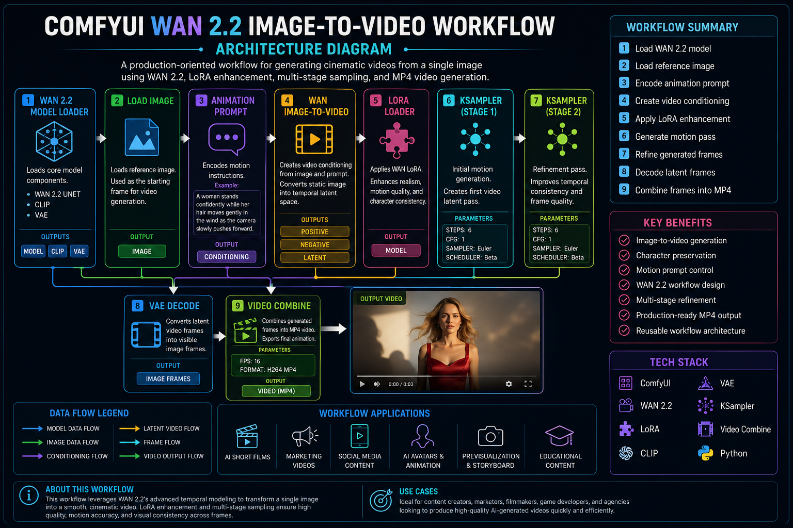
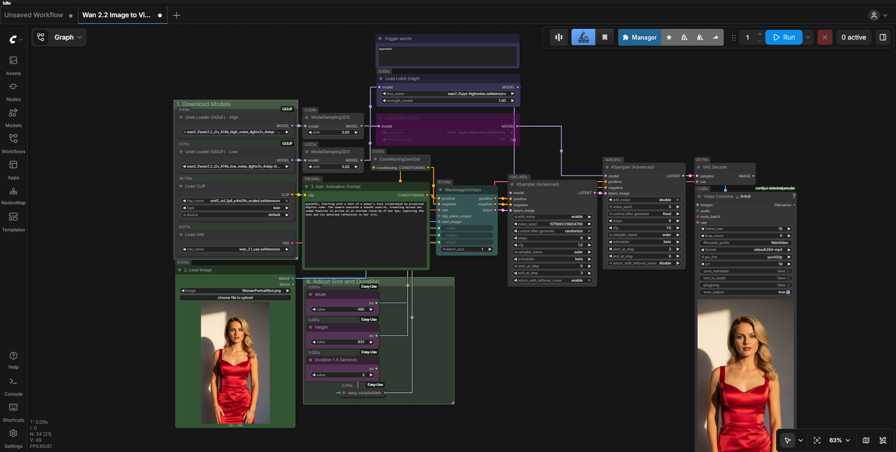
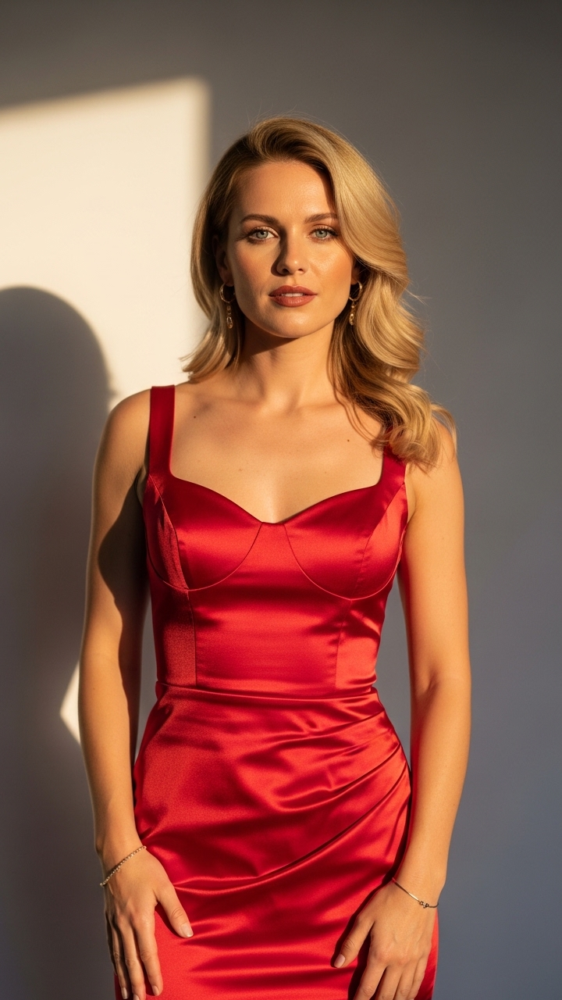

# ComfyUI WAN 2.2 Image-to-Video Generation Pipeline

A production-oriented ComfyUI workflow designed for transforming static images into cinematic video sequences using WAN 2.2.

This project demonstrates AI-driven motion synthesis, image-to-video generation, LoRA enhancement, and video export workflows.

---

## Project Overview

The objective of this workflow is to convert a single image into a short cinematic video while preserving character identity and visual consistency.

The workflow combines:

* WAN 2.2 Video Model
* LoRA Enhancement
* Motion Prompting
* Multi-Stage Sampling
* Video Encoding

---

## Architecture Diagram

---

## Workflow Graph

---

## Sample Outputs

### Input Image

### Final Video

See: 

---

## Workflow Structure

Load WAN Model

↓

Load Image

↓

Motion Prompt

↓

WAN ImageToVideo

↓

LoRA Enhancement

↓

KSampler Stage 1

↓

KSampler Stage 2

↓

VAE Decode

↓

Video Combine

↓

MP4 Export

---

## Technical Stack

| Category        | Technology    |
| --------------- | ------------- |
| Workflow Engine | ComfyUI       |
| Video Model     | WAN 2.2       |
| Enhancement     | LoRA          |
| Sampling        | KSampler      |
| Encoding        | Video Combine |
| Programming     | Python        |
| Framework       | PyTorch       |

---

## Documentation

| Document                                                                  | Description                            |
| ------------------------------------------------------------------------- | -------------------------------------- |
| 📘 [Node Explanations](docs/node-explanations.md)                         | Detailed explanation of workflow nodes |
| 📗 [Optimization Notes](docs/optimization-notes.md)                       | Workflow testing and optimization      |

---

## Learning Objectives

* Image-to-Video Generation
* Motion Prompt Engineering
* WAN 2.2 Workflows
* Video Synthesis
* AI Animation Pipelines
* Production Workflow Design

---

## Future Improvements

* Character Consistency
* Multi-Shot Story Generation
* Camera Motion Control
* Lip Sync Integration
* Full AI Video Pipeline
